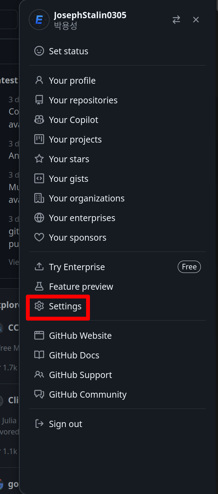
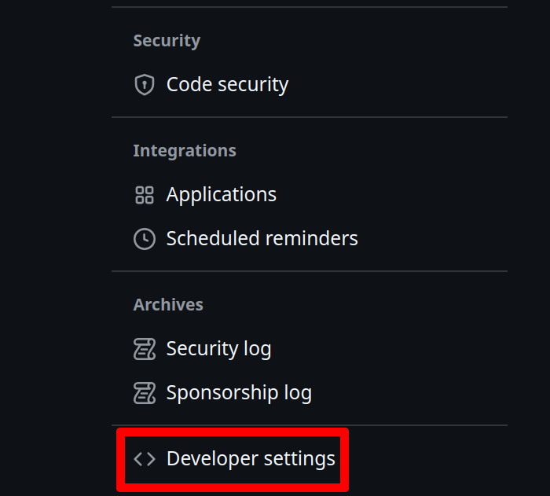
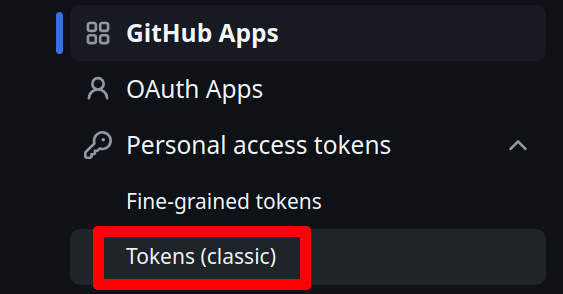
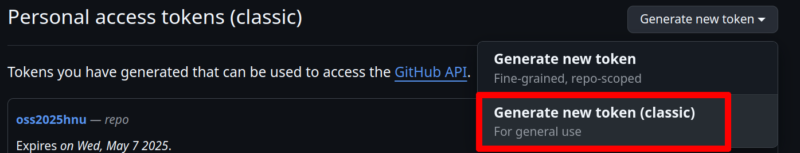
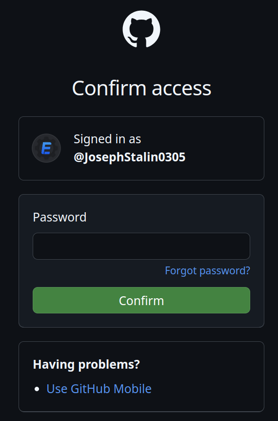
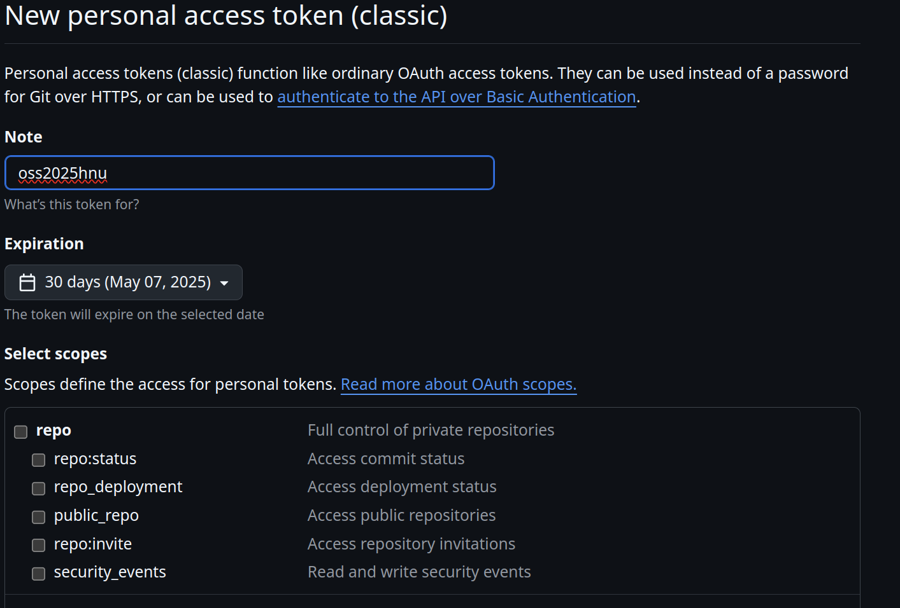
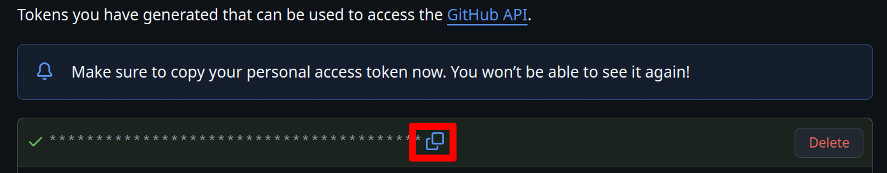

# GitHub 토큰 발급 방법

GitHub 토큰(Personal Access Token)은 비밀번호 대신 사용하여 GitHub API에 접근하거나 Git 작업을 인증할 수 있는 문자열입니다. 비밀번호보다 안전하며, 특정 범위의 권한만 부여하고 만료 기간을 설정할 수 있어 유용합니다.

다음은 GitHub 토큰을 발급하는 방법입니다.

1. GitHub 설정 페이지 접근
    - [GitHub 웹사이트](https://github.com/)에 로그인 합니다.
    - 우측 상단의 프로필 사진을 클릭합니다.
    - 드롭다운 메뉴에서 **Settings** 을 클릭합니다.

    

2. 개발자 설정 메뉴 접근
    - 좌측 사이드바에서 가장 아래쪽에 있는 **Developer settings** 을 클릭합니다.
        
    

3. Personal access tokens (개인 접근 토큰) 메뉴 접근
    - 좌측 사이드바에서 **Personal access tokens > Tokens (classic)** 을 클릭합니다.
    
    

4. 새로운 토큰 생성
    - 우측 상단의 **Generate new token (classic)** 버튼을 클릭합니다.
    
    

5. 깃허브 계정 비밀번호 입력
    - 비밀번호를 입력해 본인의 계정임을 확인한다.

    

6. 토큰 이름 및 권한 부여
    - `Note` 토큰의 이름을 입력한다.
    - `Expiration` 토큰의 유효기간을 정한다.
    - `Select scopes` 허가한 권한을 설정한다.
        - 현재 프로젝트에 실행하기 위해 필요한 권한은 없으므로 해당 부분은 넘어가도 된다.
     

7. 토큰 생성
    - 토큰 생성 화면에서 스크롤을 아래로 내려 **Generate token** 버튼을 클릭한다.
    
    - 이후 **Personal access tokens (classic)** 화면으로 돌아오며, 화면에 보이는 토큰값을 복사하면된다.
    

8. 사용 방법
    - 아래는 생성한 GitHub 토큰을 적용하는 예시입니다.

```python
while True:
    url = f"https://api.github.com/repos/{self.repo_path}/issues"
    response = requests.get(
        url,
        headers={'Authorization': f'token {self.token}'},  # Authorization 헤더에 토큰 추가
        params={
            'state': 'all',
            'per_page': self.per_page,
            'page': self.page
        }
    )

    if response.status_code == 200:
        issues = response.json()

        # 각 이슈의 제목을 출력하거나 처리하는 로직
        for issue in issues:
            print(issue['title'])  # 이슈 제목 출력

        # 만약 반환된 이슈가 100개 미만이라면 마지막 페이지임
        if len(issues) < self.per_page:
            break  # 반복 종료
        else:
            self.page += 1  # 다음 페이지로 넘어감
    else:
        print(f"Error: {response.status_code}")
        break  # 오류가 발생하면 반복 종료